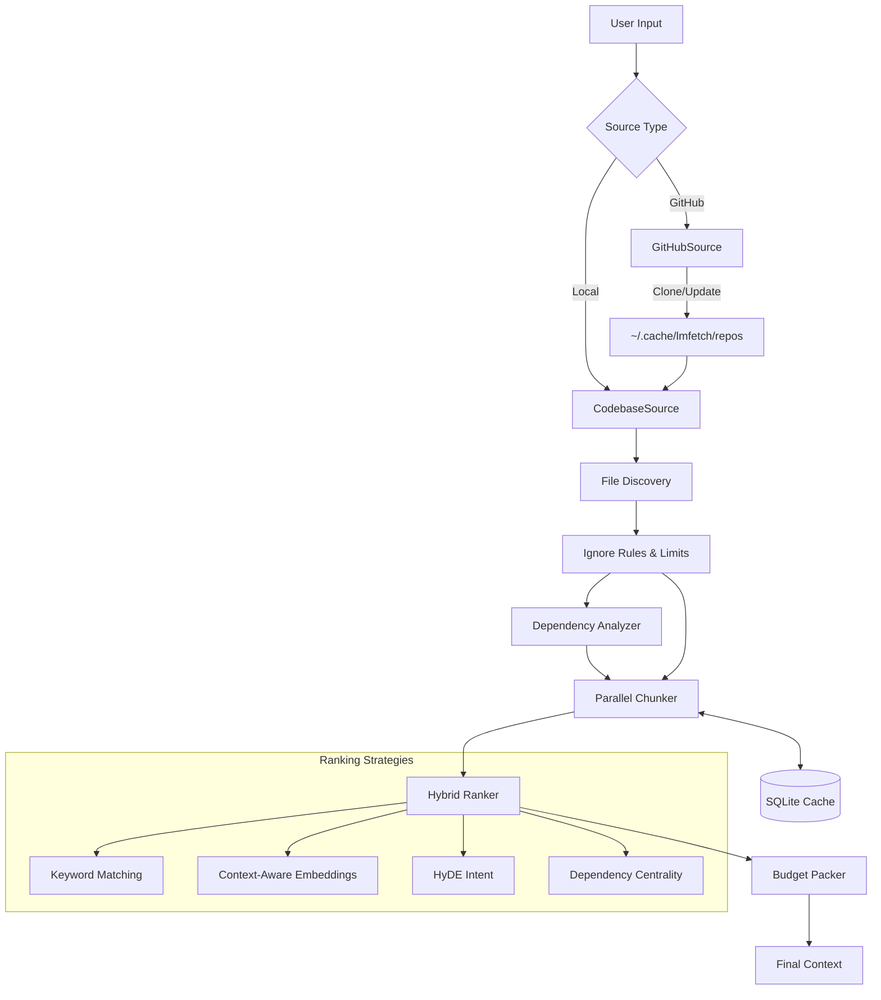

# lmfetch Architecture & Implementation Guide

`lmfetch` is a CLI tool designed to fetch, chunk, rank, and pack code context for Large Language Models (LLMs). It transforms a raw codebase (local or GitHub) into a highly relevant prompt context that fits within a token budget.

## High-Level Pipeline

The retrieval pipeline consists of 6 distinct stages:

1.  **Discovery**: Identifying relevant files from local paths or remote repositories.
2.  **Analysis**: Building dependency graphs to understand code structure.
3.  **Chunking**: Breaking files into meaningful code blocks (functions, classes).
4.  **Caching**: Storing processed chunks to avoid redundant computation.
5.  **Ranking**: Scoring chunks based on relevance to the user's query.
6.  **Selection**: Packing the highest-value chunks into the token budget.



## Core Components

### 1. Source Management (`lmfetch/sources/`)
*   **`CodebaseSource`**: Scans local directories.
    *   **Filtering**: Automatically ignores `node_modules`, `.git`, lockfiles, and strictly ignores "noise" files like `CHANGELOG`, `HISTORY`, `LICENSE`.
    *   **Safety**: Skips files larger than 1MB or 20,000 lines unless `--force-large` is used.
*   **`GitHubSource`**: Handles remote repositories.
    *   **Persistence**: Clones to `~/.cache/lmfetch/repos/<owner>/<repo>`.
    *   **Updates**: Checks `git pull` if the cache is older than 1 hour.

### 2. Processing & Caching (`lmfetch/builder.py`, `lmfetch/cache.py`)
Processing code is CPU-intensive. `lmfetch` optimizes this using:
*   **Parallelization**: `ProcessPoolExecutor` allows multiple files to be regex-parsed simultaneously, bypassing the Global Interpreter Lock (GIL).
*   **Granular Caching**:
    *   **Backend**: SQLite (`~/.cache/lmfetch/cache.db`).
    *   **Strategy**: Files are hashed (SHA256). If the hash matches, chunks are loaded from the DB, skipping the expensive parsing step.
    *   **Schema**:
        *   `files`: path, hash, mtime, last_accessed.
        *   `chunks`: file_id, content, type (function/class), name, line numbers.

### 3. Chunking Strategy (`lmfetch/chunkers/`)
Instead of fixed-size text splitting, `lmfetch` uses **AST-heuristic regex patterns** to identify logical code blocks:
*   **Python**: `def`, `class`, `async def`.
*   **JavaScript/TypeScript**: `function`, `const = () =>`, `class`, `interface`.
*   **Rust/Go/Java**: Structs, interfaces, funcs, impls.

This ensures that if a function is retrieved, the *entire* function is retrieved, providing better context to the LLM.

### 4. Hybrid Ranking Engine (`lmfetch/rankers/`)
The `HybridRanker` combines three distinct signals to score code chunks (0.0 to 1.0):

#### A. Keyword Matching (BM25-lite)
*   Checks for exact matches of query terms in the code.
*   Good for: Finding specific variable names, error codes, or function names.

#### B. Context-Aware Embeddings + HyDE
*   **Vectorization**: Uses `ai_query` (OpenAI/Gemini) to generate vector embeddings.
*   **Context Injection**: Raw code is ambiguous. `lmfetch` prepends metadata before embedding:
    ```text
    File: auth/user.py
    Type: class
    Name: User
    ---
    class User: ...
    ```
*   **HyDE (Hypothetical Document Embeddings)**:
    1.  The system asks an LLM: *"Write a hypothetical code snippet that answers: {query}"*
    2.  It embeds this *hypothetical* code.
    3.  It finds real code that looks like the hypothetical code.
    *   *Benefit*: Connects natural language ("how do I log in") to code implementation (`def verify_password`).

#### C. Graph Centrality (Importance)
*   Files that are imported frequently (e.g., `utils.py`, `config.py`) get a "Centrality Boost".
*   This ensures that foundational code is more likely to be included.

#### D. Heuristics
*   **Markdown Penalty**: Documentation files (`.md`) receive a 40% score penalty to prioritize actual code logic.

## Reliability & Performance
*   **Retries**: All API calls utilize a `@retry` decorator with exponential backoff to handle transient network issues.
*   **Async/Await**: The core pipeline is fully asynchronous, allowing network I/O (embeddings) and disk I/O to overlap.

## Usage

```bash
# Basic usage
uv run lmfetch . "how does auth work"

# Force processing of large files
uv run lmfetch . "query" --force-large

# Clean cache
uv run lmfetch --clean-cache
```
