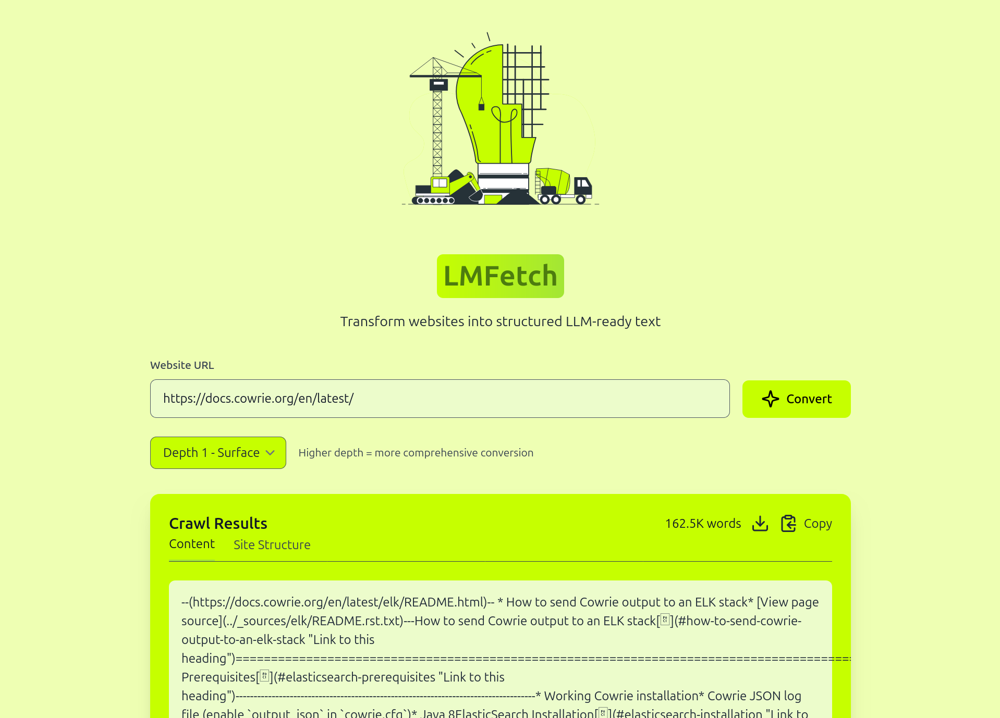

## LMFetch

A tool to convert any website into LLM-ready text  - structured markdown.




> [!NOTE] 
> Currently it not yet a hosted service. you can clone and use locally instead.

> [!WARNING]
> The current approach work best for server rendered website and would struggle for heavily client rendered websites.
 
## steps.

1. Clone repo:

```bash
git clone url
```

2. API (virtual env and dependecites):

- create a python virtual env.

```bash

cd api

python3 -m venv venv

source venv/bin/activae
```

- Install dependecies & start server.

```bash
pip install -r requirements.txt

fastapi run main.py
```

the server should run by default on `localhost:8000`

3.  Frontend:

The frontend is mostly not needed, but provides an intuitive interface.

use curl if you don't need the frontend.

```bash
curl http://localhost:8000/gx?url=URL_TO_CRAWL&max_depth=2 (best within 1-3) 
```


Install the frontend dependies and run in needed.

```bash
cd frontend/

pnpm i

pmpm dev
```


